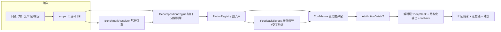

# LuminaX 归因能力升级设计（基于现有 10 张表）

**日期：** 2026-08-11
**状态：** 设计草案，待评审
**目标版本：** 下一迭代（不引入新表、不改数据库结构）
**核心约束：** 所有因子与证据均来源于现有 10 张表，不新增数据源

## 1. 背景与目标

### 1.1 现状

当前归因链路只做"总量级"诊断：

- 归因由 4 个固定因子组成：`orders`（订单量）、`aov`（客单价）、`refund`（退款率）、`promotion`（促销依赖度）；
- `mainIssue` 只回答"缺口来自订单量还是客单价"；
- "历史基准"实际是**全数据集日均**（14 天自身均值），不是环比/同比/真实历史窗口；
- 渠道、时段、品类只有当期金额，**没有基准对比**，无法回答"哪个维度贡献了多少缺口"；
- 店长反馈只作为文本传给模型，未与量化数据交叉验证；
- SQL 版与 JS 遗留版 `mainIssue` 判定口径不一致，且无 parity 测试覆盖；
- 归因结果无 requestId、无持久化、不可追溯。

### 1.2 目标

将归因从"总量诊断"升级为三层结构：

| 层级 | 问题 | 升级内容 |
|---|---|---|
| L1 总量 | 缺口来自订单量还是客单价？ | 保留现有 `orderVsAov`，统一口径 |
| L2 结构 | 缺口拆到渠道/时段/品类/客数/促销各贡献多少？ | 新增**缺口分解引擎** |
| L3 原因 | 为什么渠道掉？为什么退款多？ | 新增**反馈信号提取 + 量化交叉验证** |

### 1.3 非目标

- 不新增外部数据（天气、竞品、节假日表等），但允许在**反馈文本中提取**的外部事件作为质性证据；
- 不做生产级因果推断（小样本下只输出"信号"与"假设"，不宣称因果）；
- 本轮不实现前端归因可视化（作为后续阶段）。

## 2. 现状归因链路（完整梳理）

### 2.1 触发

`intent-classifier.ts` 用关键词 `为什么 / 归因 / 原因` 判定 `intent = "attribution"`。

### 2.2 路由

`business-agent.ts` 的 `execute()`：

1. `toSqlMetricIntent("attribution")` → 走固定指标路径；
2. `metricQueryExecutor.listStoreIds()` → 门店清单；
3. `accessControl.authorizeScope()` → 权限裁剪；
4. `metricQueryExecutor.execute("attribution", scope)` → 计算归因数据；
5. `intentResult.intent === "attribution"` → 交给 `attributionAgent.analyze(...)`；
6. 前端 `view-router` 将视图切到 dashboard。

### 2.3 计算（双实现）

| 路径 | 实现 | 说明 |
|---|---|---|
| MySQL 生产路径 | `MySqlSqlMetricQueryExecutor.executeAttribution()` | 8 段 `ATTRIBUTION_*_SQL` 并发查询后组装 `AttributionData` |
| JSON/遗留路径 | `attribution-engine.ts` 的 `computeAttributionData()` | JS 计算，供 JSON 数据源与测试使用 |

8 段 SQL 职责：

| SQL 常量 | 产出 |
|---|---|
| `ATTRIBUTION_SUMMARY_SQL` | 总览 + `orderVsAov` + `mainIssue` |
| `ATTRIBUTION_STORES_SQL` | `storeNames` 映射 |
| `ATTRIBUTION_DAILY_SQL` | 每日明细 |
| `ATTRIBUTION_BREAKDOWN_SQL` | 渠道/品类/时段结构 |
| `ATTRIBUTION_CHANNEL_DAILY_SQL` | 渠道×日期 |
| `ATTRIBUTION_REFUND_SQL` | 退款汇总/按日/按门店 |
| `ATTRIBUTION_FEEDBACK_SQL` | 店长反馈 |
| `ATTRIBUTION_PROMOTION_SQL` | 促销汇总 + Top5 |

### 2.4 解释

`attribution-agent.ts`：RAG 检索（当前 Noop）→ 拼 prompt（问题 + AttributionData JSON + 本地摘要 + RAG 文档）→ DeepSeek（temperature=0.15）→ 失败降级到 `buildAttributionNarrative` + `answer-formatters/attribution.ts`。

### 2.5 现状局限（升级前必读）

| # | 局限 | 影响 |
|---|---|---|
| 1 | "历史基准" = 全数据集日均 | `orderVsAov` 诊断失真 |
| 2 | SQL 版与 JS 版 `mainIssue` 口径不一致，无 parity 测试 | 换数据源结果会变 |
| 3 | 阈值全部硬编码（drop>1、±5% 等） | 不可调参 |
| 4 | 因子固定 4 个 | 无法覆盖结构维度 |
| 5 | 维度 breakdown 只有当期金额 | 无法回答"维度贡献了多少缺口" |
| 6 | 无 requestId / 持久化 | 无法追溯、复盘 |
| 7 | RAG 为 Noop | 知识无法注入 |
| 8 | 模型输出无结构化解析 | 归因结论不可计算 |
| 9 | 反馈文本未与量化数据交叉验证 | "为什么"缺乏证据 |

## 3. 升级后总体架构



## 4. 归因数据契约 v2（AttributionDataV2）

在现有 `AttributionData` 基础上**只增不改**，保证旧消费方（格式化器、前端）兼容。

```jsonc
{
  // ---- 现有字段（保留）----
  "dateRange": { "start": "2025-05-01", "end": "2025-05-14" },
  "storeIds": ["S001"],
  "storeNames": { "S001": "上海商场店" },
  "salesSummary": { "totalSales": 0, "totalTarget": 0, "achievementRate": 0, "totalOrders": 0, "avgOrderValue": 0 },
  "dailyDetail": [],
  "orderVsAov": { "mainIssue": "orders", "salesDrop": 0, "ordersDrop": 0, "aovDrop": 0 },
  "channelBreakdown": {},
  "categoryBreakdown": {},
  "daypartBreakdown": {},
  "channelDaily": [],
  "refundSummary": {},
  "refundDaily": [],
  "refundByStore": [],
  "managerFeedback": [],
  "promotionSummary": {},

  // ---- 新增字段 ----
  "requestId": "attr_20260811_001",
  "benchmark": {
    "type": "target | last_week | same_weekday | peer_group | custom",
    "source": "sales_target_daily",
    "window": { "start": "2025-05-08", "end": "2025-05-14" }
  },
  "decomposition": {
    "totalGap": -25176,
    "orderVolumeGap": -18200,
    "aovGap": -6976,
    "interaction": 0,
    "dimensionContributions": [
      { "dimension": "channel", "name": "Delivery", "contribution": -12340, "share": 0.49 },
      { "dimension": "daypart", "name": "Afternoon Tea", "contribution": -6800, "share": 0.27 }
    ]
  },
  "factorContributions": [
    {
      "factor": "channel_delivery",
      "contribution": -12340,
      "direction": "down",
      "benchmark": "last_week",
      "evidence": "外送占比 35%→28%，订单量 -180",
      "confidence": "high"
    }
  ],
  "feedbackSignals": [
    {
      "date": "2025-05-08",
      "storeId": "S002",
      "type": "Staffing",
      "daypart": "Breakfast",
      "channel": "Dine-in",
      "direction": "negative",
      "controllable": true,
      "claim": "排班不足影响早餐时段",
      "verified": true,
      "confidence": "high"
    }
  ]
}
```

## 5. 基准引擎（BenchmarkResolver）

### 5.1 基准类型

| 类型 | 口径 | 数据来源 | 适用 |
|---|---|---|---|
| `target` | 目标值 | `sales_target_daily` | 达成率类归因（默认） |
| `last_week` | 上一同周期 | 现有日期回推 7 天 | 环比 |
| `same_weekday` | 上周同日 | 现有日期回推 7 天 | 剔除星期效应 |
| `peer_group` | 同业态门店均值 | `store_master.store_type` 分组 | 横向对比 |
| `custom` | 显式窗口 | 请求参数 | 灵活分析 |

### 5.2 星期效应处理

从 `date` 推导 `DAYOFWEEK`，`same_weekday` 基准天然剔除星期效应；使用其他基准时输出"星期效应已剔除/未剔除"标记。

### 5.3 配置

`LUMINAX_ATTRIBUTION_BENCHMARK` 环境变量或请求参数指定，默认 `target`；允许"目标 + 上周"双基准（缺口对目标、趋势对环比）。

## 6. 缺口分解引擎（DecompositionEngine）

核心方法：**把总销售缺口按维度拆成确定金额，且分解和 = 总缺口（自洽校验）**。

### 6.1 第一层：量价拆分

```
Δ销售额 = Δ订单量 × 基准客单价 + Δ客单价 × 基准订单量 + 交互项
交互项   = Δ订单量 × Δ客单价
```

校验：三部分之和与 Δ销售额 完全相等。

### 6.2 第二层：结构拆分

对每个维度（渠道/时段/品类/促销/退款/客数）：

```
维度贡献 = 实际维度金额 − 基准维度金额
基准维度金额 = 总基准 × 基准维度占比（按目标占比分摊，或按上周占比）
```

### 6.3 瀑布图输出

`目标销售额 → 订单量缺口 → 客单价缺口 → 渠道偏移 → 时段偏移 → 品类偏移 → 促销偏移 → 退款影响 → 实际销售额`，每段都有确定金额，用于前端可视化和模型解释输入。

## 7. 因子库（FactorRegistry）— 全部基于现有 10 张表

| 因子 ID | 名称 | 数据来源 | 计算口径 | 证据形式 | 可控性 | 优先级 |
|---|---|---|---|---|---|---|
| `customer_count` | 客数因子 | `store_sales_daily.customer_count` | 客数缺口 = 实际客数 − 基准客数 | "客流减少 X 人" | 部分 | P1 |
| `attach_rate` | 连带率因子 | 订单数/客数 | `order_count / customer_count` | "人均下单 1.08→1.02" | 内部 | P1 |
| `items_per_order` | 每单件数因子 | `sales_by_category.item_count` | `item_count / order_count` | "每单件数 2.1→1.8" | 内部 | P1 |
| `channel_*` | 渠道因子 | `sales_by_channel` | 各渠道 Δ金额 + 占比偏移 | "外送占比 35%→28%" | 部分 | P0 |
| `daypart_*` | 时段因子 | `sales_by_daypart` | 各时段 Δ金额 + 时段客单变化 | "下午茶缺口 -¥6,800" | 部分 | P0 |
| `category_*` | 品类因子 | `sales_by_category` | 各品类 Δ金额 + 结构偏移 | "炸鸡占比 40%→32%" | 内部 | P0 |
| `promo_penetration` | 促销渗透率 | `promotion_daily.promo_orders` ÷ 总订单 | `promo_orders / order_count` | "促销覆盖 28%→19%" | 内部 | P1 |
| `promo_efficiency` | 促销效率 | `promo_sales / promo_orders` | 促销客单 vs 正常客单 | "促销客单低于正常 X 元" | 内部 | P1 |
| `promo_theme` | 促销主题变化 | `product_scope` | 活动主题分布偏移 | "主推从炸鸡转向饮品" | 内部 | P2 |
| `refund_reason_*` | 退款原因因子 | `refund_cancel_daily.main_reason` | 各原因金额/单数占比 | "配送延迟类退款占比升至 40%" | 部分 | P1 |
| `cancel_rate` | 取消率因子 | `cancelled_orders ÷ 订单数` | 履约质量信号 | "取消 14 单/日 vs 基准 5 单" | 内部 | P1 |
| `feedback_*` | 反馈事件因子 | `store_manager_feedback` | 类型/文本 → 证据 | "5/8 排班不足（店长反馈）" | 视类型 | P2 |
| `weekday_effect` | 星期效应 | 从 `date` 推导 | 同星期对比 | "周四基准本身偏低" | 外部 | P1 |
| `peer_gap` | 业态横向差 | `store_master.store_type` | 同业态均值对比 | "低于同类店均值 8%" | 外部 | P1 |
| `maturity` | 门店成熟度 | `opening_date` | 新店/老店分组 | "新店爬坡期，目标偏高" | 外部 | P2 |
| `dataset_crosscheck` | 标签交叉校验 | `store_sales_attribution_dataset` | 与分解结果一致性 | "结论与数据集标签一致" | - | P2 |

因子统一接口（后续可注册式扩展）：

```ts
interface AttributionFactor {
  id: string;
  label: string;
  controllable: "internal" | "external" | "partial";
  compute(input: FactorInput): FactorResult;
}
interface FactorResult {
  contribution: number;   // 金额缺口贡献
  direction: "up" | "down" | "flat";
  evidence: string;
  confidence: "high" | "medium" | "low";
}
```

## 8. 反馈信号提取与交叉验证（ManagerFeedbackSignals）

### 8.1 反馈信号 schema

```jsonc
{
  "date": "2025-05-08",
  "storeId": "S002",
  "type": "Staffing",            // Staffing | External Traffic | Delivery Platform | Product Supply | Local Event | Weather
  "daypart": "Breakfast",
  "channel": "Dine-in",
  "direction": "negative",       // negative | neutral | positive
  "controllable": true,
  "claim": "排班不足影响早餐时段",
  "matchedMetric": {
    "daypartOrderDrop": -0.183,
    "aligned": true,
    "consistencyDays": 2
  },
  "verified": true,
  "confidence": "high"
}
```

### 8.2 文本挖掘维度

| 维度 | 示例 | 用途 |
|---|---|---|
| 事件根因 | "two sick leaves" | 细分到排班缺口 |
| 影响方向 | "delivery stayed stable" | 区分负面/已缓解 |
| 时间锚点 | "afternoon", "morning shift" | 对齐 daypart |
| 外部实体 | "office building", "platform ranking" | 外部因素识别 |
| 可控性 | Staffing/Supply=内部；Weather/Platform/Holiday=外部 | 建议优先级 |
| 因果强度词 | "due to", "impacted" | 置信度参考 |

### 8.3 交叉验证规则

1. 反馈事件坐标（date × store × daypart × channel）与对应量化数据对齐；
2. 量化数据同向且连续 ≥2 天 → `verified=true, confidence=high`；
3. 量化数据不支撑 → `verified=false, confidence=medium/low`，输出"待验证假设"；
4. 外部不可控因素验证通过 → 归因标注"外部因素，非门店执行问题"。

### 8.4 数据约束与迭代建议

- 当前反馈仅 7 条 / 70 店天（覆盖率 10%），只能作为**证据增强器**，不能作为主因子；
- 建议：反馈改结构化表单（必选影响时段/渠道/方向/可控性/金额估计）；异常日自动提醒店长补报。

## 9. 置信度与证据等级

### 9.1 置信度规则

| 维度 | 规则 |
|---|---|
| 幅度 | 贡献占缺口比例 >15% → 高分 |
| 持续性 | 连续 ≥3 天同向 → 提升一级 |
| 交叉验证 | 与反馈/数据集标签吻合 → 升为"确定"，否则标"相关信号/待验证" |

### 9.2 证据等级

- **确定事实**：分解计算所得（金额缺口、占比偏移）；
- **相关信号**：相关性/趋势一致但样本不足；
- **待验证假设**：反馈声称但量化未支撑。

## 10. 解释层升级

### 10.1 结构化模型输出

让归因模型输出固定 JSON（复用 `extractJsonObject` + zod 校验）：

```jsonc
{
  "mainIssue": "orders",
  "factors": [
    { "factor": "channel_delivery", "contribution": -12340, "confidence": "high" }
  ],
  "actions": ["恢复外送平台排名", "补充早餐时段排班"],
  "validationMetrics": ["外送订单量连续 3 天回升"]
}
```

解析失败降级到本地 narrative，保证不丢结论。

### 10.2 Prompt 升级要点

- 模型**只解释不发明**：输入带 `decomposition` + `factorContributions`，禁止模型自行编造因子；
- 要求区分"确定事实 / 相关信号 / 待验证假设"；
- 要求按可控性排序建议（先内部可控，再外部因素说明）。

### 10.3 RAG 升级方向

接入历史归因案例库（同门店/同业态的历史结论与验证结果），`AttributionKnowledgeRetriever` 接口已预留。

## 11. 升级后归因输出示例

```text
结论: S001 本周缺口 -¥25,176（达成率 96.7%）
量价拆分: 订单量缺口 -¥18,200（-72%）| 客单价缺口 -¥6,976（-28%）
结构贡献（Top5）:
  1. 外送渠道   -¥12,340  (占比 35%→28%)        [高置信, 与配送平台反馈吻合]
  2. 下午茶时段 -¥6,800  (时段客单 -¥4)          [高置信]
  3. 炸鸡品类   -¥5,120  (每单件数 2.1→1.8)      [中置信]
  4. 退款影响   -¥3,100  (配送延迟类退款+18单)    [中置信, 待验证]
  5. 促销收缩   -¥2,400  (促销覆盖 28%→19%)      [低置信]
建议: 优先恢复外送渠道排名（对应 5/8 店长反馈"平台排名下滑"）
```

## 12. 落地路线图

| 优先级 | 内容 | 依赖 AI | 验收标准 |
|---|---|---|---|
| P0 | 统一 `mainIssue` 口径（共享纯函数） | 否 | SQL/JS 结果一致，补 parity 测试 |
| P0 | 缺口分解引擎（量价 → 维度贡献） | 否 | 分解自洽：贡献和 = 总缺口 |
| P0 | 结构化 `factorContributions` 输出 | 否 | 契约示例可生成 |
| P1 | 基准引擎（target / last_week / same_weekday / peer_group） | 否 | 同数据集可复现 |
| P1 | 客数/连带率/每单件数因子 | 否 | 各因子输出有效证据 |
| P1 | 退款原因分布 + 取消率因子 | 否 | 与退款明细一致 |
| P1 | 星期效应剔除 | 否 | 同星期对比可复现 |
| P2 | 反馈信号提取 + 交叉验证 | 可选（关键词规则可先做） | 反馈→验证结果可追溯 |
| P2 | 解释层结构化输出 + zod 校验 | 是 | 解析失败可降级 |
| P2 | RAG 案例库接入 | 是 | 检索命中可注入 prompt |

## 13. 风险与开放问题

| 风险/问题 | 应对 |
|---|---|
| 双实现口径漂移 | P0 补 attribution parity 测试 |
| 14 天样本太小 | 因子只输出"信号"，置信度按持续性打折 |
| 反馈覆盖率仅 10% | 反馈只作证据增强；推进结构化表单 |
| 模型输出不稳定 | 结构化 JSON + 解析降级 + 本地 narrative |
| 分解自洽性 | 每次计算做"贡献和 = 总缺口"断言 |
| 与现有消费方兼容 | AttributionDataV2 只增字段，不改旧字段 |

## 14. 附：现有 10 张表可用字段速查

| 表 | 可归因字段 |
|---|---|
| `store_master` | `store_type`（业态）、`opening_date`（成熟度）、`region/city/area_type` |
| `store_sales_daily` | `actual_sales`、`order_count`、`customer_count`、`avg_order_value`、`refund_amount`、`cancelled_orders` |
| `sales_target_daily` | `sales_target`、`order_target`、`aov_target` |
| `sales_by_channel` | `channel`（Dine-in/Takeaway/Delivery）、`sales_amount`、`order_count` |
| `sales_by_daypart` | `daypart`（Breakfast/Lunch/Afternoon Tea/Dinner）、`sales_amount`、`order_count`、`avg_order_value` |
| `sales_by_category` | `category`（Burger/Fried Chicken/Drinks/Combo Meal/Snack）、`sales_amount`、`order_count`、`item_count` |
| `promotion_daily` | `promotion_name`、`product_scope`、`promo_sales`、`promo_orders`、`coupon_used` |
| `refund_cancel_daily` | `refund_amount`、`refund_orders`、`cancelled_orders`、`main_reason`（6 类） |
| `store_manager_feedback` | `feedback_type`（6 类）、`feedback_detail`、`affected_daypart`、`affected_channel`、`manager_name` |
| `store_sales_attribution_dataset` | `top_channel`、`weak_daypart`、`top_category`、`manager_feedback`（交叉校验标签） |
