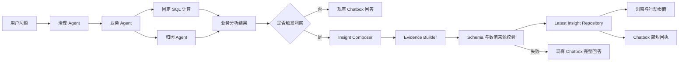

# LuminaX 洞察与行动工作区设计

**日期：** 2026-08-13  
**状态：** 已通过产品设计评审，待实现  
**范围：** 重构现有“经营分析”页签，消除与“经营概览”和 Chatbox 的内容重复

## 1. 背景与问题

当前工作台包含“经营概览”“经营分析”“经营周报”和右侧灵犀助手，但“经营分析”没有形成独立价值：

- 页面上半部分直接展示 Chatbox 的最后一条 AI 回复；
- 页面下半部分再次嵌入完整的经营概览 KPI 和图表；
- 用户切换页面后没有获得更深的分析结构或新的经营动作；
- Chatbox 的沟通过程与正式分析成果混在一起，不利于管理者快速阅读和后续跟踪。

本次将“经营分析”重构为“洞察与行动”。它自动沉淀最近一次有效经营分析，形成可恢复、可验证、可执行的结构化分析快照。

## 2. 产品定位与页面分工

| 区域 | 回答的问题 | 主要职责 |
| --- | --- | --- |
| 经营概览 | 现在经营表现如何？ | 固定 KPI、趋势和结构监控 |
| 灵犀助手 | 我想分析什么？ | 提问、追问、请求入口和简短回执 |
| 洞察与行动 | 哪里有问题、证据是什么、下一步做什么？ | 结构化结论、证据链、待核查项和行动建议 |
| 经营周报 | 如何形成周期性正式汇报？ | 周期性汇总、正式阅读和导出 |

“洞察与行动”不是聊天记录的另一种排版，也不是经营概览的复制。它是最近一次有效经营分析的正式成果页。

## 3. 触发规则

### 3.1 更新洞察的请求

以下意图在成功返回有效经营判断后更新洞察：

- 异常检测；
- 门店对比；
- 归因分析；
- 订单趋势与客单价趋势；
- 渠道、品类和时段结构分析；
- 促销贡献分析；
- 退款风险分析。

### 3.2 不更新洞察的请求

- 单一指标值查询；
- 自定义指标查询；
- 经营周报生成；
- 被治理 Agent 拒绝的请求；
- 无数据、权限不足或业务分析失败的请求；
- 普通系统提示和操作反馈。

触发规则由服务端基于规范化意图判断，不依赖前端检查问题文本。

## 4. 信息结构

### 4.1 分析来源

显示触发问题、门店范围、分析周期、对比基准和更新时间。洞察快照始终保留生成时的范围，不随全局筛选器静默变化。

### 4.2 核心判断

使用一段简洁文字概括整体表现、主要问题和优先处理对象。核心判断不能引入固定 SQL 结果中不存在的数值。

### 4.3 关键发现

展示 3 至 5 项并按经营影响排序。每项包括：

- 唯一标识；
- 结论标题与简要说明；
- 影响指标或门店；
- 关键数值及单位；
- 风险等级；
- 数据可信度；
- 关联的证据标识。

### 4.4 支持证据

支持证据只回答当前发现需要证明的问题，不复用经营概览的全量图表。

第一阶段支持以下确定性证据类型：

- `store_target_variance`：门店目标缺口贡献；
- `period_variance`：当前周期与对比周期变化；
- `anomaly_dates`：异常日期及基准对比；
- `channel_contribution`：渠道贡献拆解；
- `category_contribution`：品类贡献拆解；
- `daypart_contribution`：时段贡献拆解；
- `metric_drivers`：订单量、客单价、促销和退款等关联指标。

图表必须：

- 直接显示关键数值、单位和基准；
- 明确正负方向；
- 使用风险色与正向色表达业务含义；
- 标明它支持哪项关键发现；
- 提供简短的证据解读；
- 不将相关性包装为已证明的因果关系。

### 4.5 待核查项

数据不能直接支持的原因判断进入独立的待核查区。每项说明：

- 当前观察到的事实；
- 尚未得到证明的假设；
- 需要补充核查的数据或现场信息。

### 4.6 建议型行动清单

每项行动包括优先级、行动内容、责任角色和验证指标。用户可以勾选完成，状态保存到服务端。

POC 不包含具体人员指派、消息提醒、审批、截止日期通知和跨用户任务协作。

## 5. 页面与交互状态

### 5.1 生成中

保留上一份完整洞察，顶部显示“正在生成新洞察”。不清空页面，不显示未完成结构。

### 5.2 生成成功

- 原子替换并保存最新洞察；
- 自动切换至“洞察与行动”；
- 对触发洞察的意图，服务端在洞察保存成功后让 Chatbox 仅显示“已更新若干发现和行动”的简短回执，不再流式输出同一份完整分析正文；
- Chatbox 提供 2 至 3 个与当前结论相关的后续问题；
- 新洞察的行动勾选状态从未完成开始。

若洞察整理、验证或保存失败，则回退到现有 Chatbox 完整回答，保证用户仍能获得本次分析结果。该失败不清空或覆盖上一份洞察。

### 5.3 普通查询

Chatbox 正常流式回答，不切换页签，不更新洞察。

### 5.4 发现与证据联动

点击关键发现后，页面滚动到对应证据并短暂突出显示。一个发现可以关联多个证据，一个证据也可以支持多个发现。

### 5.5 行动勾选

前端先进入待保存状态，服务端成功后确认完成状态；保存失败则恢复原状态并显示轻量错误提示。

### 5.6 筛选范围变化

修改全局门店或日期不会改写已有洞察。当当前筛选与洞察快照范围不一致时显示提示，并提供“切换到洞察范围”命令。

### 5.7 空状态与异常状态

- 尚无洞察：展示简洁说明及权限允许的快捷分析问题；
- 新洞察生成失败：保留旧洞察，Chatbox 回答不受影响；
- 保存失败：不覆盖旧洞察；
- 权限失效：整份洞察隐藏，不提供裁剪后的残缺结论；
- 无旧洞察且生成失败：展示可重试空状态。

### 5.8 响应式布局

桌面端保持中央工作区和右侧助手。移动端继续使用“经营数据 / 分析决策”切换，洞察、证据和行动区按单列展示，横向图表改为可读的窄屏布局。

## 6. 系统架构

### 6.1 组件边界



业务计算结果与面向用户的回答文本需要解耦。洞察链路消费服务端结构化计算结果，而不是从已经生成的 Markdown 回答中反向解析数据。

### 6.2 Insight Composer

`InsightComposer` 将一次业务分析结果投影为稳定的洞察数据模型。它可以使用 DeepSeek 选择结论、排序发现、撰写解释和建议，但具备以下边界：

- 不是新的自治 Agent；
- 不拥有独立对话记忆；
- 不参与治理、意图分类和业务模块调度；
- 不访问数据库；
- 不计算或修改指标；
- 不生成 HTML、JavaScript 或图表配置。

### 6.3 Evidence Builder

`EvidenceBuilder` 是确定性程序模块。它根据规范化意图和固定 SQL 返回的数据生成证据数据，不使用模型计算数值。

模型可以建议使用哪种证据类型，但最终证据类型、数据值、单位、排序和范围由服务端校验并构造。

### 6.4 持久化仓储

定义与存储技术无关的 `LatestInsightRepository`：

```ts
interface LatestInsightRepository {
  findByUserId(userId: string): Promise<InsightSnapshot | null>;
  replaceForUser(snapshot: InsightSnapshot): Promise<InsightSnapshot>;
  updateActionState(
    userId: string,
    insightId: string,
    actionId: string,
    completed: boolean
  ): Promise<InsightSnapshot>;
}
```

POC 使用 `.luminax/latest-insights.json`，按用户保存一份最新洞察，并通过进程内写队列和临时文件替换保证单进程原子写入。仓储接口后续可以替换为 MySQL 实现。

## 7. 数据模型

```ts
type InsightSeverity = "high" | "medium" | "low" | "positive";
type InsightConfidence = "high" | "medium" | "needs_verification";

interface InsightScope {
  storeIds: string[];
  startDate: string;
  endDate: string;
  comparisonLabel: string | null;
}

interface InsightFinding {
  id: string;
  title: string;
  summary: string;
  severity: InsightSeverity;
  confidence: InsightConfidence;
  subjectIds: string[];
  metricCode: string;
  value: number;
  unit: string;
  displayValue: string;
  evidenceIds: string[];
}

interface InsightEvidence {
  id: string;
  type:
    | "store_target_variance"
    | "period_variance"
    | "anomaly_dates"
    | "channel_contribution"
    | "category_contribution"
    | "daypart_contribution"
    | "metric_drivers";
  title: string;
  supportsFindingIds: string[];
  unit: string;
  baselineLabel: string;
  series: Array<{
    key: string;
    label: string;
    value: number;
    baseline?: number;
    direction: "positive" | "negative" | "neutral";
  }>;
  interpretation: string;
}

interface InsightVerificationItem {
  id: string;
  observedFact: string;
  hypothesis: string;
  requiredCheck: string;
}

interface InsightAction {
  id: string;
  priority: "P0" | "P1" | "P2";
  title: string;
  ownerRole: "区域经理" | "店长" | "运营" | "财务" | "数据分析";
  verificationMetricCode: string;
  verificationMetricLabel: string;
  completed: boolean;
  completedAt: string | null;
}

interface InsightSnapshot {
  id: string;
  userId: string;
  sourceQuestion: string;
  sourceIntent: string;
  scope: InsightScope;
  headline: string;
  findings: InsightFinding[];
  evidence: InsightEvidence[];
  verificationItems: InsightVerificationItem[];
  actions: InsightAction[];
  accessRequirements: Array<{
    tableName: string;
    columns: string[];
  }>;
  sourceFingerprint: string;
  createdAt: string;
  updatedAt: string;
}
```

`sourceFingerprint` 由用户、规范化意图、门店范围、日期范围和已计算数据摘要生成，用于诊断和防止重复写入，不包含 API Key、Prompt 或原始个人信息。

`value`、`unit` 和 `displayValue` 由服务端确定性格式化；模型只选择需要表达的指标及说明文字。`accessRequirements` 仅在服务端仓储中保存，用于读取时重新授权，不返回给前端。

## 8. 接口契约

### 8.1 获取最新洞察

`GET /api/insights/latest`

- 必须登录；
- 服务端读取当前用户最新洞察；
- 按洞察创建时的完整数据需求重新校验表、字段和门店权限；
- 无洞察返回 `200 { "insight": null }`；
- 权限失效返回 `403`，不返回局部内容；
- 响应设置 `Cache-Control: no-store`。

### 8.2 更新行动完成状态

`PATCH /api/insights/latest/actions/:actionId`

请求体：

```json
{ "completed": true }
```

- 必须登录；
- 只能更新当前用户最新洞察中的行动；
- 客户端同时提交当前 `insightId`，防止旧页面修改新洞察；
- 洞察或行动不匹配返回 `409` 或 `404`；
- 成功返回更新后的行动或快照版本。

### 8.3 Chat SSE 扩展

保留现有 `status`、`content`、`intent` 和 `error` 事件，新增：

```json
{
  "type": "insight",
  "status": "generating | updated | failed",
  "insightId": "...",
  "findingCount": 3,
  "actionCount": 3
}
```

`generating` 允许前端保留上一份洞察并显示更新状态。只有洞察完成验证并成功保存后才发送 `updated`；此后流式返回简短回执。若生成失败，发送不含内部错误详情的 `failed`，随后按现有流程返回完整 Chatbox 回答。洞察错误不使用 Chat SSE 的通用 `error` 事件。

## 9. 生成与保存流程

1. 治理 Agent 审核用户输入；
2. 业务 Agent 识别意图并调用固定 SQL；
3. 涉及归因时调用归因 Agent；
4. 服务端判断该意图是否应更新洞察；
5. 不触发洞察时，Chatbox 按现有协议返回回答；
6. 触发洞察时，SSE 发送 `insight: generating`，`InsightComposer` 基于用户问题、范围、规范化意图和结构化计算结果生成文本结构；
7. `EvidenceBuilder` 从计算结果确定性生成证据；
8. 服务端验证 Schema、数量、引用关系、权限和所有数值来源；
9. 验证成功后原子替换用户的最新洞察；
10. SSE 发送 `insight: updated` 和简短回执，前端读取最新快照并自动切换页签；
11. 若第 6 至 9 步失败，SSE 发送 `insight: failed` 并回退到现有完整 Chatbox 回答，旧洞察保持不变。

## 10. 权限与安全

- 洞察生成只使用服务端权限过滤后的结构化计算结果；
- 前端不能提交分析数据、证据数值或用户标识来创建洞察；
- 读取洞察时重新校验创建该洞察所需的全部表、字段与门店范围；
- 任一必需权限缺失时隐藏整份洞察，不展示裁剪后可能失真的结论；
- 更新行动状态时同时校验登录用户、洞察 ID 和行动 ID；
- 模型生成文本按纯文本渲染或经过 Markdown 安全渲染；
- 模型输出中的数值必须匹配允许的计算结果及受控格式化值；
- 不向模型传递数据库凭据、权限策略、System Prompt、API Key 或其他 Agent 记忆；
- 日志不记录完整敏感输入或模型 Prompt。

## 11. 失败与并发策略

- 同一用户多个分析并行时，以服务端开始时间和请求 ID 判定最新请求；旧请求完成后不得覆盖更新请求；
- 洞察替换采用先验证、后写入，禁止先删除旧数据；
- 行动更新使用 `insightId` 进行乐观并发校验；
- JSON 文件损坏时返回可诊断错误并保留原文件，不自动写入空仓储；
- 模型超时、非法 JSON、引用不存在、数字不受支持或证据为空均视为洞察生成失败；
- 业务回答、周报和经营概览不依赖洞察模块可用性。

## 12. POC 范围

### 12.1 包含

- “经营分析”更名为“洞察与行动”；
- 自动沉淀最新有效经营分析；
- 按用户服务端保存一份最新洞察；
- 核心判断、3 至 5 项关键发现；
- 发现与支持证据关联；
- 确定性证据图表；
- 待核查项；
- 建议型行动清单及完成勾选；
- 刷新或重新登录后的恢复；
- 范围不一致提示和范围切换；
- Chatbox 简短回执和后续追问；
- 桌面端和移动端适配。

### 12.2 不包含

- 历史洞察列表、收藏、置顶和版本对比；
- 具体人员指派、通知、审批和跨用户协作；
- AI 自动执行经营动作；
- 洞察数据写入正式业务数据库；
- 管理后台中的洞察配置中心；
- 用户自定义证据图表。

## 13. 测试策略

### 13.1 单元测试

- 触发意图和排除意图判断；
- Insight Composer Schema、数量和引用校验；
- 模型编造或改写数字时拒绝保存；
- 每种 Evidence Builder 的确定性输出；
- 发现与证据引用完整性；
- 最新洞察仓储的替换、恢复和损坏文件处理；
- 行动完成状态更新与冲突检测。

### 13.2 应用与接口测试

- 有效分析生成并保存洞察；
- 普通指标查询不更新洞察；
- 洞察失败不影响 Chatbox 回答；
- 无权门店、字段或表不能读取旧洞察；
- 用户不能读取或更新他人的洞察；
- SSE 仅在成功保存后发送洞察更新事件；
- 并行请求中旧结果不能覆盖新结果。

### 13.3 前端测试

- 自动切换、生成中、空状态和旧洞察保留；
- Chatbox 不重复完整分析正文；
- 发现点击后定位对应证据；
- 范围不一致提示和恢复范围；
- 行动勾选成功、失败回滚和刷新恢复；
- 桌面端和移动端布局无重叠、溢出或不可读图表。

## 14. 验收标准

1. 有效经营分析成功后自动生成并保存结构化洞察；
2. Chatbox 与“洞察与行动”不再重复展示相同正文；
3. 页面不再复用完整经营概览图表；
4. 每项发现都有数据证据或明确标记为待核查；
5. 所有展示数值均可追溯至固定 SQL 计算结果；
6. 用户刷新或重新登录后仍可查看最新洞察；
7. 无权门店或字段不会通过旧洞察泄漏；
8. 新洞察失败不会影响 Chatbox，也不会覆盖旧结果；
9. 行动勾选状态可以保存并恢复；
10. 经营概览、经营周报和现有 Agent 调度保持兼容。
